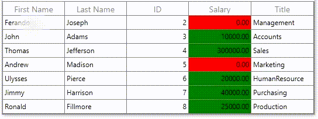

# How to change the back color of cell when editing in WPF DataGrid (SfDataGrid)?

## About the sample
This example illustrates how to change the back color of cell when editing in WPF DataGrid (SfDataGrid)

[WPF DataGrid](https://www.syncfusion.com/wpf-ui-controls/datagrid) (SfDataGrid) does not provide direct support to change the background color of cell when editing. You can change the background color of the cell when editing in [SfDataGrid](https://help.syncfusion.com/cr/wpf/Syncfusion.UI.Xaml.Grid.SfDataGrid.html) by customized the editor control `TextChanged` event based on the corresponding column renderer.

```C#

this.dataGrid.CellRenderers.Remove("Numeric");
this.dataGrid.CellRenderers.Add("Numeric", new GridCellNumericRendererExt());

public class GridCellNumericRendererExt : GridCellNumericRenderer
{
       public override void OnInitializeEditElement(DataColumnBase dataColumn, DoubleTextBox uiElement, object dataContext)
       {
             base.OnInitializeEditElement(dataColumn, uiElement, dataContext);
             uiElement.TextChanged += UiElement_TextChanged;
       }

       private void UiElement_TextChanged(object sender, TextChangedEventArgs e)
       {
             var doubleTextBox = (sender as DoubleTextBox);
             //while editing change the condition based on value
             if (doubleTextBox.Text != "0.00")
                 doubleTextBox.Background = new SolidColorBrush(Colors.Green);
             else if (doubleTextBox.Text == "0.00")
                 doubleTextBox.Background = new SolidColorBrush(Colors.Red);
       }
}

```

[SfDataGrid](https://help.syncfusion.com/cr/wpf/Syncfusion.UI.Xaml.Grid.SfDataGrid.html) provides support for various built-in column types. Each column has its own properties and renderer for more details please refer the below documentation link.

**Documentation Link:** https://help.syncfusion.com/wpf/datagrid/column-types



#### Note: The background color of cell when editing changed only editor control in SfDataGrid. You need to apply condition based background color for GridCell based on column type

[GridCell](https://help.syncfusion.com/cr/wpf/Syncfusion.UI.Xaml.Grid.GridCell.html) background is changed using converter, where converter returns the value based on Salary property of underlying record. 

```XML

<Window.Resources>
        <local:CustomValueConverter x:Key="customValueConverter"/>
</Window.Resources>

<syncfusion:GridNumericColumn  MappingName="Salary" >
                    <syncfusion:GridNumericColumn.CellStyle>
                        <Style TargetType="syncfusion:GridCell">
                            <Setter Property="Background" Value="{Binding Salary, Converter={StaticResource customValueConverter}}" />
                        </Style>
                    </syncfusion:GridNumericColumn.CellStyle>
</syncfusion:GridNumericColumn>

```

```C#

public class CustomValueConverter : IValueConverter
{
        public object Convert(object value, Type targetType, object parameter, System.Globalization.CultureInfo culture)
        {
            //while change background color based on condition
            if (value == null || ((value != null) && double.Parse(value.ToString()) == 0))
                return new SolidColorBrush(Colors.Red);
            return new SolidColorBrush(Colors.Green);

        }

        public object ConvertBack(object value, Type targetType, object parameter, System.Globalization.CultureInfo culture)
        {

            throw new NotImplementedException();
        }
}

```


## Requirements to run the demo
Visual Studio 2015 and above versions


